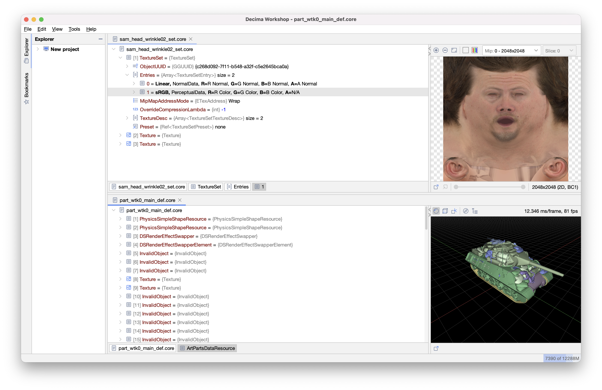
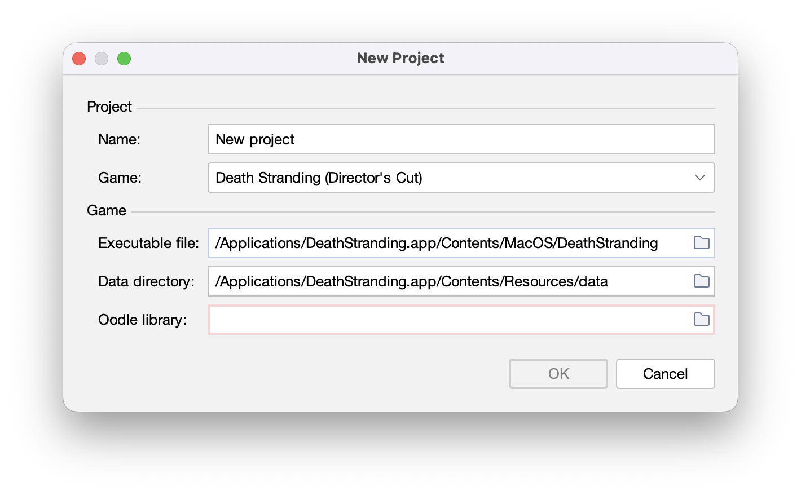

# Decima Workshop (for macOS)

### Shamelessly vibe coded with Claude.


This is a fork of [Decima Workshop by ShadelessFox](https://github.com/ShadelessFox/decima-workshop).

Death Stranding: Director's Cut is available in the [App Store](https://games.apple.com/us/game/6449748961) for Apple
devices, and I wanted to see if I could extract the audio files to create ringtones from them. [505 Games has some 
files available to download](https://deathstrandingpc.505games.com/en/) (bottom of the page), 
but surprisingly, not the "like" sound effect.

I initially started with making small modifications to enable the file explorer to open the Death Stranding
executable and data directory when starting a new project. But then, I found it cumbersome to use the explorer to sift 
through the graph to hunt down specific resources. That's when I thought to just let Claude take the reins.

Disclaimer: I haven't thoroughly tested the app, so there likely still are bugs.

## What's Different in This Fork
* Works with the macOS DeathStranding.app executable and data directory
* Mounts extra packfiles for the macOS port's streamed assets to load
* 3D model viewer works using offscreen rendering (solution for a bug when showing a model and texture in split view)
* [Scripts](audio-extraction-scripts/README.md) for extracting audio files (my original goal) based on what I had Claude do to track down
specific audio files
  * Dialogue lives under `localized/sentences/` (a virtual path inside the game's packed archives): search the subtitle
text, and the matching `SentenceResource`'s UUID, byte-reversed, is the filename of its `.wem` audio
  * Sound effects are events inside Wwise SoundBanks: carve the banks out of the game's archives, and `wwiser`
resolves an event name to the `.wem` it plays

## Build and Run
Requires JDK 24.

Create .app by running:
```sh
./mvnw clean package -DskipTests
```
Launch it with:
```sh
open decima-app/target/dist/decima.app
```

## Tips


When starting a New Project, set these fields:

Executable file: `/Applications/DeathStranding.app/Contents/MacOS/DeathStranding`

Data directory: `/Applications/DeathStranding.app/Contents/Resources/data`

For oodle, read the [Wiki in the original repo](https://github.com/ShadelessFox/decima-workshop/wiki/CLI#getting-oodle),
and then point it to wherever you downloaded it to.

Please refer to the original [README](README-upstream.md) and [Wiki from the original repo](https://github.com/ShadelessFox/decima-workshop/wiki)
for additional instructions on setting up Decima Workshop.